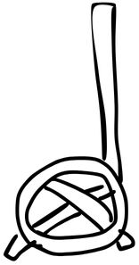

# Midterm — Phases 1–4

My midterm submission with all four phases. Each phase has code and some notes.

---

## What's in here
- **Phase1.jpeg** — my original sketch
- **Phase2.js** — basic p5.js version on a 150×150 canvas
- **Phase3.js** — made it into a function so I could draw it multiple times
- **Phase4.js** — grid version that tiles the object
- **README.md** — this file

---

## Phase 1 — Digital Sketch



Started with a hand-drawn sketch. It's got an ellipse for the ring part, a long handle line, and a diagonal line crossign through the ellipse.

---

## Phase 2 — p5.js Translation (150×150)
```js
function setup() {
  createCanvas(150, 150);     
  background(255);            
  noFill(); stroke(0);        

  strokeWeight(6); ellipse(75, 95, 80, 64);  // the ring
  strokeWeight(5); line(55, 88, 95, 104);    // diagonal going one way
  strokeWeight(5); line(60, 105, 90, 85);    // diagonal going the other way
  strokeWeight(10); line(115, 25, 115, 120); // handle (made it thicker)
  strokeWeight(6); line(112, 115, 120, 108); // bottom left tail
  strokeWeight(6); line(37, 118, 22, 130);   // top right tail
}
```

Used different strokeWeights to make some lines stand out more. The ring is just an ellipse and everything else is lines with different coordinates.

---

## Phase 3 — Function + Transformations (≥400×400)
```js
const NAT_W = 150, NAT_H = 150; // keeping track of the original size

function setup() {
  createCanvas(500, 500);  
  background(255);
  noLoop();
}

function drawObject(x, y, s) {
  push();                   // save everything
  translate(x, y);          // move to where we want it
  scale(s);                 // make it bigger or smaller
  noFill(); stroke(0);

  strokeWeight(6); ellipse(75, 95, 80, 64); 
  strokeWeight(5); line(55, 88, 95, 104);   
  strokeWeight(5); line(60, 105, 90, 85);   
  strokeWeight(10); line(115, 25, 115, 120);
  strokeWeight(6); line(112, 115, 120, 108);
  strokeWeight(6); line(37, 118, 22, 130);  

  pop();                    // put everything back
}

function draw() {
  drawObject(0, 0, 1);      // first one at normal size
  drawObject(220, 50, 1.2); // second one a bit bigger and moved over
}
```

Wrapped all the drawing code into a function so I could reuse it. The translate moves where it draws and scale changes the size. Push and pop are important - they keep each object separate so the transforms don't mess each other up.

---

## Phase 4 — Tiling with Grid + Scaling
```js
const NAT_W = 150, NAT_H = 150;
let COLS = 10, ROWS = 10; // change these to get different grids

function setup() {
  createCanvas(600, 600); 
  noLoop();
}

function drawObject(x, y, s) {
  push(); translate(x, y); scale(s); noFill(); stroke(0);

  strokeWeight(6); ellipse(75, 95, 80, 64); 
  strokeWeight(5); line(55, 88, 95, 104);   
  strokeWeight(5); line(60, 105, 90, 85);   
  strokeWeight(10); line(115, 25, 115, 120);
  strokeWeight(6); line(112, 115, 120, 108);
  strokeWeight(6); line(37, 118, 22, 130);  

  pop();
}

function draw() {
  const cellW = width / COLS, cellH = height / ROWS;
  const s = 0.9 * Math.min(cellW / NAT_W, cellH / NAT_H); // figure out how big to make it

  for (let cx = 0; cx < COLS; cx++) {
    for (let cy = 0; cy < ROWS; cy++) {
      const x = cx * cellW + (cellW - NAT_W * s) / 2;
      const y = cy * cellH + (cellH - NAT_H * s) / 2;
      drawObject(x, y, s); // draw it in the middle of each cell
    }
  }
}
```

This one uses nested loops to fill the whole canvas with a grid. The scale factor (s) is calculated so the object fits nicely in each cell - I used 0.9 so there's a little breathing room. The math for x and y centers each object in its grid cell. Works with different grid sizes - tried 5×5, 10×10, and 20×20.
